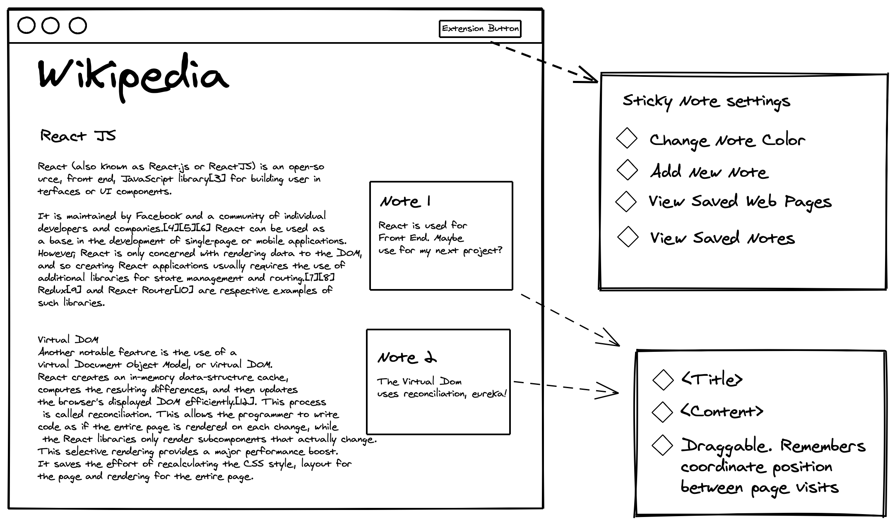

## Building our extension

The web is replete with great learning resources, but it's oftentimes difficult to capture your thoughts when reading through dense topics. Research suggests that writing down notes while you read helps [improve knowledge retention](https://www.researchgate.net/publication/277951569_The_Effects_of_Note-Taking_Skills_Instruction_on_Elementary_Students%27_Reading).

So, for this tutorial, we'll build a simple extension that saves sticky notes on any webpage. The sticky notes will persist between visit sessions, so you can always revisit your notes. Here's a simple mockup of what we'll build:

## Create React App

The best way to create a new react app is with `npx create-react-app`
..

## Chrome Extension Configuration

Every chrome extension comes packages with

### Creating the manifest

### Content Script

### Popup script

### Create the Sticky Note Component

## Inject JS to the Webpage

### Modify Index.js

### Add the Extension Manifest

## Create a Settings Panel

### Create a browserAction Popup

## Persist Data in Chrome Storage

### Create a Background Script

### Make the Sticky Note a Shadow Component

## Publish to the Chrome Store

### Instructions

### Improving Your Odds of Getting Approved
