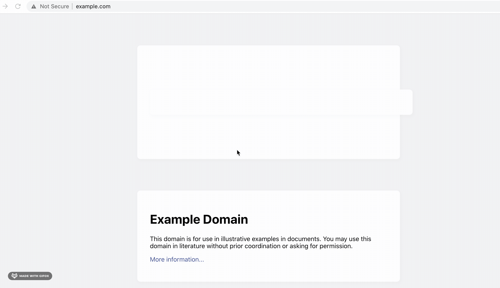

## Building our extension

The web is replete with great learning resources, but it's oftentimes difficult to capture your thoughts when reading through dense topics. Research suggests that writing down notes while you read helps [improve knowledge retention](https://www.researchgate.net/publication/277951569_The_Effects_of_Note-Taking_Skills_Instruction_on_Elementary_Students%27_Reading).

So, for this tutorial, we'll build a simple extension that saves sticky notes on any webpage. The sticky notes will persist between visit sessions, so you can always revisit your notes. Here's a simple mockup of what we'll build:


## Create React App

The best way to create a new react app is with `npx create-react-app`
..

We are going to focus first on just building the react app, and then add the chrome extension functionality later.

Run `npx create-react-app [YOUR_APP_NAME]` (we named ours react-chrome-sticky-note-extension) from a command line instance, and `cd` into the resulting directory, and open your favorite code editor (we use VSCode). This will give you the following boilerplate file structure:


Right off the bat we are going to download a module to help us out with styling our app. Frmo the root directory of your app (i.e. YOUR_APP_NAME), install styled-components into your app, with either `yarn add styled-components` or `npm install styled-components`

Let's start with the file `App.js`. This will be the main component for our app. Let's go ahead and rename it, to something like `StickyNotes.js`. Also change the name of the component being rendered in the file in a similar fashion, from `App` to `StickyNotes`. Adjust the corresponding import in `index.js` (or let VSCode automatically updated it for you). Go ahead delete all the boilerplate in the return statement of the `StickyNotes` component.

Next, we are going to make some styled components to use in our `StickyNotes` component. At the top of `StickyNotes.js` add the following:

StickyNotes.js

```jsx
// import the module
import styled from "styled-components";

// the components
const Container = styled.div`
  z-index: 2;
  border: 1px solid grey;
  position: absolute;
  background: white;
  top: ${(props) => props.y + "px"};
  left: ${(props) => props.x + "px"};
`;

const Header = styled.div`
  height: 20px;
  background-color: papayawhip;
`;

const StyledButton = styled.button`
  height: 20px;
  border: none;
  opacity: 0.5;
  float: right;
`;

const StyledTextArea = styled.textarea`
  color: dark grey;
  height: 200px;
  width: 200px;
  border: none;
  background-color: hsla(0, 0%, 100%, 0.2);
`;
```

if you're unfamiliar with styled-components, it's a very popular styling solution for React and you can read more about it here.
Note that in `Container` we are passing props. More on this later.

We are building this app with React Hooks. If you are unfamiliar with Hooks, you can read about them here. Hooks seem to be here to stay, and wonderfully abstract away a lot the extraneous typing that has to happen in a React class component.

Let's create a stateful variable to hold our notes data. We will use the `useState` React hook:

StickyNotes.js:

```jsx
// import useState
import React, { useState } from 'react'

const StickyNotes = () => {
  const [notes, setNotes] = useState([])

  ...

}
```

First, let's create the funcionality that let's us add a sticky note. We will be using shift + click. Let's add a listener to the component:

StickyNotes.js:

```jsx
// add useEffect to imports
import React, { useState, useEffect } from "react";

...

const StickyNotes = () => {
  const [notes, setNotes] = useState([])

  // listen for shift + click to add note
  useEffect(() => {
    const clickListener = (e) => {
      if (e.shiftKey) {
        setNotes((prevNotes) => [...prevNotes, { x: e.pageX, y: e.pageY }]);
      }
    }
    document.addEventListener("click", clickListener);
    return () => document.removeEventListener("click", clickListener);
  }, []);

  ...

}
```

Few things to note about this `useEffect` function. Note that we are removing the listener on `useEffect` return. You can read more about cleaning up effects here. You should always remove your listeners in React, as subsequent renders will keep adding listeners unless they are removed. Note that we are using a named function for the listener callback, another necessity if we want to remove the listener (needs a reference a named function). Lastly, note the empty dependency array `[]` as the second and final argument of the `useEffect` callback function: this is intentional, as we only need to set the listener once, on the first render. You can read more about dependency arrays in regards to `useEffect` here.

For the `setNotes` function call, we are making use of JavaScript's wonderfully expressive object literal notation, and using the splat operator `...` to set our `notes` variable. You can read more about object destructuring and the splat operator here. `e.pageX, e.pageY` are the pixel coordinates of the click on the page.

Remember the props we set up to be passed to our `Container` styled component above? Let's bring that into play. Let's set up our `return` statement:

StickyNotes.js:

```jsx
...

const StickyNotes = () => {

  ...

  return (
    <div>
      {notes.map((note) => (
        <Container x={note.x} y={note.y}>
          <Header>
            <StyledButton>X</StyledButton>
          </Header>
          <StyledTextArea />
        </Container>
      ))}
    </div>
  );
}

```

The coordinates we gleaned from our shift + click listener are passed via props to the `Container` styled component, which then uses those coordinates to absolutely position itself on the page! You should now have some functionality that looks like this:


Although we are able to enter text into the `textarea`, it is not being saved at all. To do this, we need to turn the `textarea` into a controlled component. You can read more about React controlled components here. This is standard practice for React forms. We will save the note text from `textarea` alongside the coordinate data in the `notes` variable.

In `StickyNotes.js`, update the component return statement to:

```jsx
...
const StickyNotes = () => {

  ...

  return (
    <div>
      {notes.map((note) => {
        const handleChange = (e) => {
          const editedText = e.target.value;
          setNotes((prevNotes) =>
            prevNotes.reduce(
              (acc, cv) =>
                cv.x === note.x && cv.y === note.y
                  ? acc.push({ ...cv, note: editedText }) && acc
                  : acc.push(cv) && acc,
              []
            )
          );
        };

        return (
          <Container x={note.x} y={note.y}>
            <Header>
              <StyledButton>X</StyledButton>
            </Header>
            <StyledTextArea onChange={handleChange} />
          </Container>
        );
      })}
    </div>
  );
}
```

We again make use of the splat notation, as well as terneray operators (read more here) and the `&&` notation. `setNotes` here is identifying the note that is being edited (by comparing the coordinates of the note (`cv`) with the coordinates in the locally-scoped `note` variable) and adding (or editing) the `note` property.

The `textarea` is now a controlled component. You can log `notes` to the console, and see that is updating as you edit a note.

Next, let's add functionality for the delete button. Change the component `return` statement to add the following:

StickyNotes.js:

```jsx
...
return (
    <div>
      {notes.map((note) => {

        ...

        const handleDelete = () => {
          setNotes((prevNotes) =>
            prevNotes.reduce(
              (acc, cv) =>
                cv.x === note.x && cv.y === note.y ? acc : acc.push(cv) && acc,
              []
            )
          );
        };

        return (
          ...
              <Header>
                <StyledButton onClick={handleDelete}>X</StyledButton>
              </Header>
          ...
        );
      })}
    </div>
  );
```

This is the core functionality of the app! We can add notes, edit them, and delete them, and it is all saved in a single stateful variable. Next we'll turn this humble React app into a Chrome extension.

The full code of StickyNotes.js at this point is as follows:

StickyNotes.js:

```jsx
import React, { useState, useEffect } from "react";
import logo from "./logo.svg";
import "./App.css";
import styled from "styled-components";

const Container = styled.div`
  z-index: 2;
  border: 1px solid grey;
  position: absolute;
  background: white;
  top: ${(props) => props.y + "px"};
  left: ${(props) => props.x + "px"};
`;

const Header = styled.div`
  height: 20px;
  background-color: papayawhip;
`;

const StyledButton = styled.button`
  height: 20px;
  border: none;
  opacity: 0.5;
  float: right;
`;

const StyledTextArea = styled.textarea`
  color: dark grey;
  height: 200px;
  width: 200px;
  border: none;
  background-color: hsla(0, 0%, 100%, 0.2);
`;

const StickyNotes = () => {
  const [notes, setNotes] = useState([]);

  // listen for shift + click to add note
  useEffect(() => {
    const clickListener = (e) => {
      if (e.shiftKey) {
        setNotes((prevNotes) => [...prevNotes, { x: e.pageX, y: e.pageY }]);
      }
    };
    document.addEventListener("click", clickListener);
    return () => document.removeEventListener("click", clickListener);
  }, []);

  return (
    <div>
      {notes.map((note) => {
        const handleChange = (e) => {
          const editedText = e.target.value;
          setNotes((prevNotes) =>
            prevNotes.reduce(
              (acc, cv) =>
                cv.x === note.x && cv.y === note.y
                  ? acc.push({ ...cv, note: editedText }) && acc
                  : acc.push(cv) && acc,
              []
            )
          );
        };

        const handleDelete = () => {
          setNotes((prevNotes) =>
            prevNotes.reduce(
              (acc, cv) =>
                cv.x === note.x && cv.y === note.y ? acc : acc.push(cv) && acc,
              []
            )
          );
        };

        return (
          <Container x={note.x} y={note.y}>
            <Header>
              <StyledButton onClick={handleDelete}>X</StyledButton>
            </Header>
            <StyledTextArea onChange={handleChange} />
          </Container>
        );
      })}
    </div>
  );
};

export default StickyNotes;
```

## Chrome Extension Configuration

Chrome Extensions may seem daunting, but it's really all just JavaScript. A Chrome Extension really is just a set of JavaScript files that run alongside normal webpages. If you know how to use JavaScript, you know how to make Chrome extensions.

Before we start coding, let's break down how Chrome Extensions are configured.

Extensions are generally composed of 3 main JavaScript components: Content Scripts, Popup Scripts, and Background Scripts. Additionally, every chrome extension must include a `manifest.json` that tells Chrome how to run your extension.

However, things are a bit different when we're working with React. When you build a React app, all of the code gets bundled into a single js file by Webpack. Hence, all of our our JS that affects UI (content scripts and popup scripts) will be bundled into a single file, `main.js`.


- `manifest.json`- Used to instruct Chrome how to run your scripts.

- `background.js`- A script that runs behind the scenes from your active web page. This script is usually used for advanced techniques such as message passing or running async computations.

- Popup- Popup is the window that launches when you press the extension button on the Chrome Toolbar.

  - `popup.html`- The HTML document that renders when you click the extension button. `popup.js` will be used here.

  - `popup.js`- Code that is excecuted in the popup window. This script will automatically be bundled into `main.js`.

- `contentScript.js`- A content script is a js file injected into the web page that the user is viewing (i.e. wikipedia.org, google.com, etc.). This script will be responsible for making any changes to the current wepbage being viewed. This script will automatically be bundled into `main.js`.

- Assets- Any images, css, and other files used by your extension.

We'll break down each script in the following sections.

### Creating the manifest

Every Chrome Extension comes packages with a file called `manifest.json`. The manifest is used to orchestrate the Chrome Extension and instruct Chrome how and where to run your JavaScript components.

Here is what our `manifest.json` should look like:

```json
{
  "name": "React Sticky Notes App",
  "version": "1.0.0",
  "manifest_version": 2,
  "description": "Lets you annotate web pages and persists those annotations across page visits.",
  "content_scripts": [
    {
      "matches": ["<all_urls>"],
      "js": ["./main.js"],
      "css": ["/main.css"]
    }
  ],
  "browser_action": {
    "default_popup": "./popup.html"
  },
  "permissions": ["storage"]
}
```

#### Metadata

- `name`: The name will appear when on Chrome Extension Store as well as when you select or hover your extension.
- `version`: The version of your extension. You can start at any number; however, every time you push an official update to the Chrome Store, you must increment your version.
- `description`: Short description of what your app does. Note: This description is entirely separate from the description you will provide on the Chrome store page.

Your metadata will be visible at the url `chrome://extensions`


#### Scripts and permissions

- `content_scripts`:

  - `matches`: This is a required field that tells Chrome which pages to run your extension on. Since we are interested in using our extension everywhere on the web, we leave this field as `["<all_urls>"]`. Otherwise, you can specify a [string matching pattern](https://developer.chrome.com/extensions/match_patterns).
  - `js`: Since we are interested in rendering sticky notes onto our web pages, we need to inject JavaScript onto our page to do it. As mentioned earlier, Webpack will bundle all of the JS in our project into a single `main.js` file. So, we will make this field `["main.js"]`.
  - `css`: Our React code also needs css to make the components look good. So, we need to include the `main.css` file created by Webpack.

- `browser_action`: Browser action is used to specify details that are associated with the button on the Chrome Toolbar.

  - `default_popup`: The popup action can render an HTML document. We will create a special HTML file called `popup.html`with instructions to run `main.js` and render our React Components.

- `permissions`: Listing permissions in this array gives you access to certain API operations such as `chrome.storage` and `chrome.bookmarks`. For our extension, we will only need access to `chrome.storage`, so we will use `storage`. Note: When you publish to the Chrome store, **you cannot request more permissions than your extension actually uses.** If you do, your application will be rejected by Chrome store reviewers.

Our popup script will communicate to the content script (and vice versa) by using the `chrome.storage` api as an intermediary data store.


### Content Script

### Popup script

### Create the Sticky Note Component

## Inject JS to the Webpage

### Modify Index.js

### Add the Extension Manifest

## Create a Settings Panel

### Create a browserAction Popup

## Persist Data in Chrome Storage

Now that we have created our React app, written our extension boilerplate, and written build scripts to bundle our React jsx files as a single content script, we will go about adding a database to our React app. Since this is a chrome extension, we will be using the chrome.storage api (read about it here).

First, add `/* global chrome */` to the top of StickyNotes.js:

```jsx
/* global chrome */
import React, { useState, useEffect } from "react";
...
```

This will make the chrome variables available when you run the extension in the browser. But note: chrome variables are not available when the app is spun up locally in dev mode! If you try to, for example, access chrome storage via a method like `chrome.storage.local.get()` while the app is running locally, you will get a syntax error. For this reason, let's set an environment variable and an easy toggle to access it. We'll create a `.env` file in the root folder of the project:

.env:

```env
REACT_APP_LOCAL=true
```

We'll also create another file, which we'll reference to determine if the app is running locally:

constants.js:

```js
export const localMode = process.env.REACT_APP_LOCAL === "true";
```

When spinning up the app locally, set this REACT_APP_LOCAL to "true", and when building it as a chrome extension, change it to "false" (or comment out the line, or change it to literally any other string... .env vars aren't imported as boolean, it's just a string).

In StickyNotes.js, let's use another `useEffect` hook to `set()` our `notes` data to chrome storage on a note edit. We are going to organize our notes by URL; each URL will have it's own unique set of notes that the React app will save to and retrieve from chrome storage. Remember to import `localMode` from `constants.js` at the top of the file.

Let's also add a `useEffect` to access the stored notes data for the URL in question, if there is any.

StickyNotes.js:

```jsx
// import localMode
import { localMode } from "./constants";

...

const StickyNotes = () => {
  const [notes, setNotes] = useState([]);
  const url = window.location.href; // save the url to a variable

  ...

  ...


  // get notes if they're there
  useEffect(() => {
    if (!localMode) {
      chrome.storage.local.get(url, (items) => {
        items[url] && setNotes(items[url]);
      });
    }
  }, []);

  // set()
  useEffect(() => {
    if (!localMode) {
      notes.length > 0
        ? chrome.storage.local.set({ [url]: notes })
        : chrome.storage.local.remove(url);
    }
  }, [notes]);

  return (
    ...
  )
}

```

Note that we are using `chrome.storage.local` instead of `chrome.storage.sync` (read about the difference here). We are doing this primarily because of the write limits to sync.

Note also the `set`ter function removes the entry from the database if there are no notes. We don't want to be piling up URLs in our chrome storage that don't have any notes in them!

You now have a fully-functioning notes app chrome extension! It's still very bare bones and there are still some bugs, so let's continue refining it. The code as of now should look like the below.

StickyNotes.js:

```jsx
/* global chrome */
import React, { useState, useEffect } from "react";
import logo from "./logo.svg";
import "./App.css";
import styled from "styled-components";

import { localMode } from "./constants";

const Container = styled.div`
  z-index: 2;
  border: 1px solid grey;
  position: absolute;
  background: white;
  top: ${(props) => props.y + "px"};
  left: ${(props) => props.x + "px"};
`;

const Header = styled.div`
  height: 20px;
  background-color: papayawhip;
`;

const StyledButton = styled.button`
  height: 20px;
  border: none;
  opacity: 0.5;
  float: right;
`;

const StyledTextArea = styled.textarea`
  color: dark grey;
  height: 200px;
  width: 200px;
  border: none;
  background-color: hsla(0, 0%, 100%, 0.2);
`;

const StickyNotes = () => {
  const [notes, setNotes] = useState([]);
  const url = window.location.href;

  // listen for shift + click to add note
  useEffect(() => {
    const clickListener = (e) => {
      if (e.shiftKey) {
        setNotes((prevNotes) => [...prevNotes, { x: e.pageX, y: e.pageY }]);
      }
    };
    document.addEventListener("click", clickListener);
    return () => document.removeEventListener("click", clickListener);
  }, []);

  // get notes if they're there
  useEffect(() => {
    if (!localMode) {
      chrome.storage.local.get(url, (items) => {
        items[url] && setNotes(items[url]);
      });
    }
  }, []);

  // set()
  useEffect(() => {
    if (!localMode) {
      notes.length > 0
        ? chrome.storage.local.set({ [url]: notes })
        : chrome.storage.local.remove(url);
    }
  }, [notes]);

  return (
    <div>
      {notes.map((note) => {
        const handleChange = (e) => {
          const editedText = e.target.value;
          setNotes((prevNotes) =>
            prevNotes.reduce(
              (acc, cv) =>
                cv.x === note.x && cv.y === note.y
                  ? acc.push({ ...cv, note: editedText }) && acc
                  : acc.push(cv) && acc,
              []
            )
          );
        };

        const handleDelete = () => {
          setNotes((prevNotes) =>
            prevNotes.reduce(
              (acc, cv) =>
                cv.x === note.x && cv.y === note.y ? acc : acc.push(cv) && acc,
              []
            )
          );
        };

        return (
          <Container x={note.x} y={note.y}>
            <Header>
              <StyledButton onClick={handleDelete}>X</StyledButton>
            </Header>
            <StyledTextArea onChange={handleChange} />
          </Container>
        );
      })}
    </div>
  );
};

export default StickyNotes;
```

### Create a Background Script

Since our extension is very simple, we won't require a backround script. However, if you wanted to use advanced techniques such as message passing, you can create a script called `background.js`

### Make the Sticky Note a Shadow Component

One very important aspect of creating a browser extension is dealing with how it interacts with the existing content of the webpage. A React app is really just javascript, and as we saw above when crafting the `insertionPoint`, in the case of an extension, that js is simply appended to the existing html/js/css of the webpage that it is being run on. This potentially causes nasty styling conflicts, since the html/jss/css that we insert into the webpage via our React app content script is run in the contenxt of the host webpage, which has of course it's own styling rules.

Let's look at a concrete example of this. Load your chrome extension into chrome, and navigate to `www.example.com`. Shift + click to add a note, and see what happens.



Our styling!! What happened? Well clearly, `www.example.com` has its own styling rules, and they are conflicting with those of our app.

There are a few solutions here. The first is to try to override the webpage's styling by using css techniques that take a higher precedence when the browser is computing styling, such as using `!important` or inline styling. These are inelegant solutions, both because they could potentially cause the inverse problem (our extension overriding the page styles and borking them up) and because they are heavy-handed and limited in the styling issues they can address (no more `styled-components`, for example). The second is to render these notes in an `<iframe>` element. Nothing inherently wrong with this, but it ends up being very complicated and not worth the time. The third method, and the one that we will be using, is to render these `StickyNotes` components inside of a shadow DOM instance.

You can think of the shadow DOM as a "DOM within a DOM." Each shadow DOM is cut off from styling rules dictated from outside the shadow DOM, and hence makes it the perfect vehicle for making sure our styles don't conflict with those of the host webpage. You can read more about shadom DOMs here.

To implement the shadow DOM in our app, we are going to use the module `react-shadow`. Read more about it in the repo here. Go ahead and add the package to your project via `npm i react-shadow` or `yarn add react-shadow`.

Let's make a new file called `ShadowRoot.js` in our `src` folder. Add the code below:

ShadowRoot.js:

```jsx
import React, { useState } from "react";
import root from "react-shadow";
import { StyleSheetManager } from "styled-components";

export const ShadowRoot = ({ children }) => {
  const [stylesNode, setStylesNode] = useState(null);

  return (
    <root.div>
      <div ref={(node) => setStylesNode(node)}>
        {stylesNode && (
          <StyleSheetManager target={stylesNode}>{children}</StyleSheetManager>
        )}
      </div>
    </root.div>
  );
};
```

`react-shadow` creates a new instance of a shadow DOM by wrapping a React component tree in a `<div>` element to which a shadow DOM is attached. This React component tree is now free from the pesky host page styles, and can style itself how it wants without fear of conflict! Note that we are adding a `StyleSheetManager` from `styled-components`. This is necessary, as under the hood, `styled-components` works by adding a class to each styled component, and specifying in the document `<head>` the styling of those classes. But since we are now in shadow DOM-land, our React component is cut off from the `<head>` of the document--so we have to re-insert those styles into the shadow DOM.

Import `ShadowRoot` into `StickyNotes.js` and wrap the component, like so:

StickyNotes.js:

```jsx
...
import { ShadowRoot } from "./ShadowRoot";

...
...

return (
    <div>
      {notes.map((note) => {
        const handleChange = (e) => {
          ...
        };

        const handleDelete = () => {
          ...
        };

        return (
          <ShadowRoot>
            <Container x={note.x} y={note.y}>
              <Header>
                <StyledButton onClick={handleDelete}>X</StyledButton>
              </Header>
              <StyledTextArea onChange={handleChange} />
            </Container>
          </ShadowRoot>
        );
      })}
    </div>
  );
```

Go back to `www.example.com`, and voila! Our notes look the way we want them to.

### Add a dashboard / popup.html

## Publish to the Chrome Store

### Instructions

### Improving Your Odds of Getting Approved

### appendix

Stackoverflow thread on code-splitting while building, and prevent chunk files: https://stackoverflow.com/questions/53796986/build-react-app-generate-static-files-with-chunk-suffix
